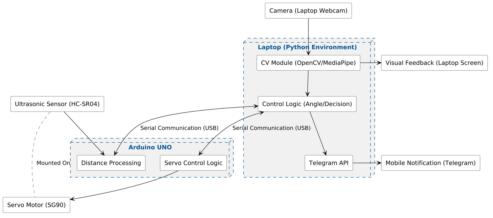
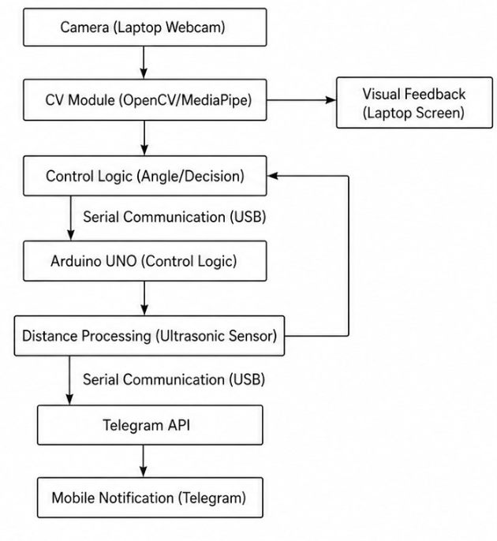
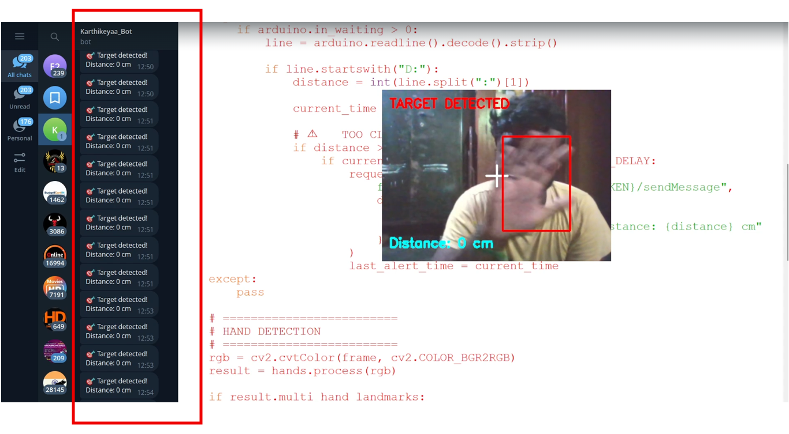

# AI Hand Tracking Surveillance System using OpenCV, Arduino and Telegram Alerts

An intelligent **real-time hand tracking surveillance system** developed using **Python, OpenCV, MediaPipe, and Arduino**. This project detects a moving target (hand), automatically tracks its position using servo control, measures distance using an ultrasonic sensor, and sends **Telegram alerts** for target detection and close-range warning.

---

## Project Overview

This system combines **computer vision**, **embedded systems**, and **IoT communication** to create a smart surveillance and tracking platform.

The webcam detects a target using **MediaPipe hand tracking**, calculates its position, and sends angle data to an **Arduino-controlled servo motor** for tracking. An **ultrasonic sensor** continuously measures distance, and when an object gets too close, a **Telegram notification alert** is sent.

---

## Key Features

- Real-time hand detection and tracking
- Automatic target following using servo motor
- Distance monitoring using ultrasonic sensor
- Telegram alert system integration
- Close-range danger notification
- Live webcam tracking visualization
- Bounding box target detection
- Low-latency serial communication with Arduino
- Smart servo angle mapping

---

## System Architecture



---

## Hardware Setup

This image shows the hardware setup used in the project.


---

## OpenCV Processing Flow

The following diagram illustrates the complete computer vision workflow.



---

## Tracking System Output

This image shows real-time target tracking and surveillance output.



---

## Working Principle

### 1. Camera Input
- Live video feed is captured using webcam.

### 2. Hand Detection
- MediaPipe detects hand landmarks.
- Bounding box generated around detected hand.

### 3. Position Calculation
- Hand center position is calculated.
- X-axis coordinate converted into servo angle.

### 4. Arduino Communication
- Angle data sent to Arduino through serial communication.

### 5. Servo Tracking
- Servo motor automatically rotates to follow target movement.

### 6. Distance Monitoring
- Ultrasonic sensor continuously measures distance.

### 7. Telegram Alerts
Notifications sent when:
- Target is detected
- Object comes too close (<15 cm)

---

## Technologies Used

| Technology | Purpose |
|------------|---------|
| Python | Core Programming |
| OpenCV | Computer Vision |
| MediaPipe | Hand Detection |
| Arduino | Servo Motor Control |
| PySerial | Serial Communication |
| Requests | Telegram API |
| Ultrasonic Sensor | Distance Measurement |
| Servo Motor | Target Tracking |
| Telegram Bot API | Real-Time Alerts |

---

## Project Structure

```

Hand-Tracking-Surveillance-System/
│── tracking_system.py
│── architecture.png
│── hardware.png
│── opencv-flow.png
│── tracking-system.png
│── report.pdf
│── requirements.txt
│── README.md

```

---

## Installation

### 1. Clone Repository

```bash
git clone https://github.com/your-username/Hand-Tracking-Surveillance-System.git
cd Hand-Tracking-Surveillance-System
```

### 2. Install Required Libraries

```bash
pip install -r requirements.txt
```

---

## Hardware Requirements

- Arduino UNO
- Servo Motor
- Ultrasonic Sensor (HC-SR04)
- Webcam
- Jumper Wires
- Breadboard
- USB Cable

---

## Telegram Bot Setup

Create a Telegram bot using **BotFather** and replace:

```python
TOKEN = "YOUR_CODE"
CHAT_ID = "YOUR_CHAT_ID"
```

with your own bot token and chat ID.

---

## How to Run

Run the Python file:

```bash
python tracking_system.py
```

Press:

```

ESC

```

to exit the application safely.

---

## Applications

- Smart surveillance systems
- Security monitoring
- AI-based tracking systems
- Human movement tracking
- Smart defense applications
- Automated monitoring systems

---

## Future Improvements

- Face recognition integration
- Multi-object tracking
- YOLO object detection
- Wireless camera integration
- Cloud logging system
- Mobile app monitoring

---

## Challenges Solved

- Real-time hand tracking
- Stable servo control
- Delay reduction in serial communication
- Distance-based warning system
- Telegram integration for alerts

---

## Author

**Karthik**  
Mechatronics Engineering Student

---

## License

This project is licensed under the MIT License and can be used for educational purposes.
